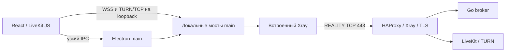

# Архитектура и план Gul

Текущая версия — **0.8.0-alpha.1**. Клиент находится в `desktop/` и полностью
написан на TypeScript/React для Electron. Go сохранён только как отдельный
серверный модуль `server/`. Legacy клиент, DSP, упаковка и транспортные
эксперименты удалены; история доступна в Git.

## Компоненты

| Компонент | Ответственность |
|---|---|
| Electron main | Полномочия сессии, пароль, broker bearer, сохранение серверов, native dialogs, транспорт, диагностика, update/tray/PTT |
| Preload | Узкий проверяемый IPC API для собственного renderer |
| React renderer + LiveKit JS | Интерфейс, микрофон, экран, кодеки, playback, VAD/gain, статистика |
| Встроенный Xray v26.3.27 | VLESS + REALITY TCP, отдельный дочерний процесс |
| Go broker | Аутентификация, roster/каналы, role grants, lease и удаление участников |
| HAProxy + LiveKit + Xray на сервере | Внешний TCP вход, TLS, SFU и TURN relay |

`server/go.mod` независим от клиента. Сервер не захватывает, не декодирует и
не перекодирует медиа. UI загружается локально с `gul://app`, не с VPS.

## Владение медиа

Chromium владеет всем захватом, кодированием, декодированием и воспроизведением.
Кадры и PCM не гоняются через IPC. Voice и screen имеют отдельные LiveKit Rooms
и peer connections; Xray mux выключен. Это разделяет TCP потоки, но не устраняет
TCP head-of-line задержки и конкуренцию за общую пропускную способность.

Микрофон запрашивает mono/48 kHz с WebRTC AEC/NS/AGC. AudioWorklet применяет
усиление и RMS gate для активации голосом; gate не является отдельной нейросетью.
При PTT/mute/deafen эффективная громкость задаётся сразу, отдельно от сохранённых
пользовательских настроек. Playback использует WebAudio GainNode, без двойного
вывода одновременно через HTML audio и WebAudio.

Экран ограничен 1280×720/30 FPS и 2 Мбит/с для видео, один слой без simulcast.
По умолчанию VP8; H264 выбирается только через проверяемую capability политику.
Стереозвук экрана не проходит голосовые AEC/NS/AGC. Подписка на чужой экран
независима от возможности собственного захвата. Не выбранные экраны
не подписываются для декодирования.

## Транспорт и границы доверия

Renderer получает только media grants текущей эпохи. Пароль и broker bearer
после подключения принадлежат main. Main проверяет профиль, hostname внутреннего
TLS, broker response и JWT назначения; redirect не выбирает новый сервер.
Local SOCKS аутентифицирован, UDP/mux выключены, назначение фиксировано.
WSS/TURN мосты проверяют Origin/Host, grant, эпоху и лимиты сообщений.
Новый канал/выход закрывает прежние медиапотоки. Прямого fallback нет.

Electron renderer: sandbox, contextIsolation, без Node integration и произвольной
навигации. Сохранение пароля требует явного согласия и защищённого keyring.
Диагностика собирается по списку разрешённых полей, а не редакцией сырых логов.
Update check сообщает о релизе и открывает проверенную GitHub страницу;
установщики автоматически не запускаются.

## Состояние и следующий тест

Миграция исходников завершена. Проверены unit/security tests, самостоятельный
broker и реальные Electron media tests через локальный и удалённый REALITY/TURN.
Удалённый тест использует синтетические источники и 20 циклов демонстрации.
Целевые установщики: Windows 10+ x64, Ubuntu 24.04+ x64, macOS arm64/x64.

Перед признанием версии стабильной нужны:

1. Реальный захват игры и stereo audio Windows 10 ↔ Ubuntu 26 в обе стороны,
   проверка loopback без возврата голосов Gul.
2. Проверка глобального удержания PTT: Windows helper, Linux GlobalShortcuts
   portal, отмена/недоступность shortcuts и отсутствие залипшего микрофона.
   Переключение клавишей остаётся доступным режимом.
3. Прогон CI установщиков на всех целевых runners и Linux capture с настоящим
   PulseAudio loopback; это отдельно от synthetic transport E2E.
4. Час игры с голосом и демонстрацией, измерение CPU/RAM, задержки и восстановления
   после потери сети. Численного преимущества перед alpha.6 пока не заявляем.

Проверки и команды — [README](README.md), deployment —
[deploy/livekit](deploy/livekit/README.md), правила работы — [CLAUDE.md](CLAUDE.md).
