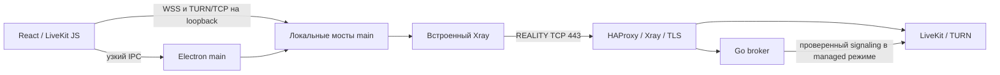

# Архитектура и план Gul

Текущая версия — **0.8.0-alpha.9**. Клиент находится в `desktop/` и полностью
написан на TypeScript/React для Electron. Go сохранён только как отдельный
серверный модуль `server/`. Legacy клиент, DSP, упаковка и транспортные
эксперименты удалены; история доступна в Git.

## Компоненты

| Компонент | Ответственность |
|---|---|
| Electron main | Полномочия сессии, пароль, личный ключ, broker bearer, сохранение серверов, capture picker, native audio helpers, транспорт, диагностика, update/tray/PTT |
| Preload | Узкий проверяемый IPC API для собственного renderer |
| React renderer + LiveKit JS | Интерфейс, микрофон, экран, кодеки, playback, VAD/gain, статистика |
| Встроенный Xray v26.3.27 | VLESS + REALITY TCP, отдельный дочерний процесс |
| Go broker | Аутентификация, постоянный каталог и ACL каналов, admission, grants, lease и удаление участников |
| HAProxy + LiveKit + Xray на сервере | Внешний TCP вход, TLS, SFU и TURN relay |

`server/go.mod` независим от клиента. Сервер не захватывает, не декодирует и
не перекодирует медиа. UI загружается локально с `gul://app`, не с VPS.

## Владение медиа

Chromium владеет всем захватом, кодированием, декодированием и воспроизведением.
Кадры и PCM не гоняются через IPC. Native audio приходит в Chromium через
приватный Linux source или ограниченный Windows loopback WebSocket. Voice и screen имеют отдельные LiveKit Rooms
и peer connections; Xray mux выключен. Это разделяет TCP потоки, но не устраняет
TCP head-of-line задержки и конкуренцию за общую пропускную способность.

Микрофон запрашивает mono/48 kHz с WebRTC AEC/AGC. При готовом RNNoise
Chromium NS выключен; при недоступном processor возвращается WebRTC NS
до открытия микрофона. AudioContext фиксирован на 48 kHz.
AudioWorklet применяет локальный RNNoise при включённом
шумодаве, усиление и RMS gate для активации голосом. RNNoise загружается из
приложения, обрабатывает 480 samples/frame и добавляет около 30 мс вместе с
адаптером render blocks. Настройки AEC/NS/AGC меняют настоящий capture через
restartTrack; операция сериализована и до готовности обработки микрофон закрыт.
При PTT/mute/deafen эффективная громкость задаётся сразу, отдельно от сохранённых
пользовательских настроек. Playback использует WebAudio GainNode, без двойного
вывода одновременно через HTML audio и WebAudio.

По умолчанию экран ограничен 1280×720/30 FPS и 2 Мбит/с для видео.
Можно выбрать 720p/60, 1080p/30 и 1080p/60 с потолками 4/5/8 Мбит/с.
Один слой без simulcast.
По умолчанию VP8; H264 выбирается только через проверяемую capability политику.
Демонстрация автоматически запрашивает системный звук вместе с видео.
Стереозвук экрана не проходит голосовые AEC/NS/AGC или RNNoise. Linux helper
исключает Gul, не меняя маршруты воспроизведения. Windows helper проверяет
process loopback и исключает дерево процессов Gul. Его очередь ограничена
120 мс; main разрешает одно соединение текущему окну после согласия на захват.
Неподдерживаемый API означает video-only, без общего микса. Выбор источника
на Windows/X11 — превью внутри Gul; Wayland — системный portal. Подписка на чужой экран
независима от возможности собственного захвата. Не выбранные экраны
не подписываются для декодирования.

## Транспорт и границы доверия

Renderer получает только media grants текущей эпохи. Пароль и broker bearer
после подключения принадлежат main. Main проверяет профиль, hostname внутреннего
TLS, broker response и JWT назначения; redirect не выбирает новый сервер.
Local SOCKS аутентифицирован, UDP/mux выключены, назначение фиксировано.
WSS/TURN мосты проверяют Origin/Host, grant, эпоху и лимиты сообщений.
Новый канал/выход закрывает прежние медиапотоки. Прямого fallback нет.

Electron renderer: sandbox, contextIsolation, без Node integration и произвольной
навигации. Сохранение пароля требует явного согласия и защищённого keyring.
Диагностика собирается по списку разрешённых полей, а не редакцией сырых логов.
Update check сообщает о релизе и открывает проверенную GitHub страницу;
установщики автоматически не запускаются.

## Состояние и следующий тест

Миграция исходников завершена. Пройденные проверки:

- Unit/security/lifecycle tests с порогом 80% строк, ветвей и функций.
- Windows/Linux/macOS arm64/x64 packaged smoke с sandbox. Linux DEB установлен.
- Windows native helper: регистрация и освобождение F8 hook; Linux portal:
  семь DBus сценариев. Физическое удержание клавиши ещё не проверено.
- Два Electron клиента через обновлённый VPS REALITY/TURN: синтетические
  голос/видео/stereo audio, чат и 20 циклов демонстрации.

Linux native capture прошёл реальный DISPLAY/PulseAudio стенд: движущиеся кадры,
лимит 720p и stereo PCM 440 Гц L / 660 Гц R через TURN/TCP. Перед стабильной версией нужны:

1. Физический микрофон на целевых компьютерах, качество AEC/NS и выбор устройств.
2. Реальный захват игры Windows 10 ↔ Ubuntu 26 в обе стороны и проверка
   process loopback без возврата голосов Gul. Громкость просмотра отдельно 0–200%.
3. Физическое удержание PTT, отпускание клавиши и смена фокуса на целевых ОС;
   отсутствие залипшего микрофона. Toggle остаётся доступным режимом.
4. Час игры с голосом и демонстрацией, измерение CPU/RAM, задержки и восстановления
   после потери сети. Численного преимущества перед alpha.6 пока не заявляем.

Проверки и команды — [README](README.md), deployment —
[deploy/livekit](deploy/livekit/README.md), правила работы — [CLAUDE.md](CLAUDE.md).

[Управление каналами](docs/CHANNELS.md) реализовано: постоянный владелец,
приглашения участников, создание/переименование/удаление пустых каналов,
закрытый доступ выбранным участникам и admission при входе/reconnect.
На сервере этот режим включается явно с bootstrap владельца.
[Звуковая цепочка](docs/AUDIO.md) проверена отдельно;
[XHTTP](docs/XHTTP.md) исследован на локальном стенде и оценён для будущего перехода.

## Подготовка alpha.6, 2026-10-08

Реализованы постоянный каталог, отдельные личные ключи, интерфейс владельца,
приглашения и доступ выбранным участникам. Настоящий LiveKit подтвердил отзыв
voice/screen, отказ старых grants и сохранение прав после перезапуска.
Два Electron клиента проверили голос, чат и стереодемонстрацию через managed
admission; личный ключ восстановился после полного перезапуска приложения.

Полная проверка клиента: 420 успешных тестов, два платформенных пропуска;
покрытие строк/ветвей/функций выше 89%. Сервер: 45 тестов с race detector,
82.8% общего покрытия и чистый vet. Deployment: 24 успешных теста.
Упакованная macOS arm64 сборка прошла запуск с sandbox и встроенным Xray.
Проверки Windows/Linux/macOS установщиков пройдены в GitHub CI,
включая managed voice/stereo и настоящий Linux keyring после полного restart.
Дополнительно локально пройдены 60 циклов демонстрации и переходов каналов.

Цепочка с одним RNNoise прошла отдельное сравнение речи и шума; выводы
и ограничения измерений — в AUDIO.md. XHTTP исследован отдельно, транспорт
работающего сервера сохраняется до отдельного перехода.
Managed mode включён на VPS после проверки отсутствия активных участников.
Профиль, общий пароль, REALITY и TLS сохранены. Владелец проверен личным ключом;
создание закрытого канала, отказ гостю, переименование и удаление проверены
через настоящий публичный TLS и встроенный Xray. Службы работают без новых
перезапусков и OOM. Два Electron клиента прошли 20 циклов voice/video/stereo;
первые кадры в этом прогоне приходили примерно за 1,9–4,9 секунды. Переход в beta зависит от физических Windows 10/Ubuntu 26
проверок и продолжительной игровой сессии.

## Исправления alpha.7, 2026-10-08

SID guards сохраняют новую демонстрацию при запоздалых событиях старой
дорожки. Очистка media ограничена владельцем voice/screen потока, поэтому
выход наблюдателя не удаляет актуальные дорожки другого соединения.
Локальное ручное mute намерение отделено от effective mute при deafen;
включение звука восстанавливает прежнее состояние микрофона.

Клиент: 431 успешный тест, два платформенных пропуска, покрытие строк/ветвей/
функций выше 90%, TypeScript и форматирование чистые. Два настоящих Electron
клиента через managed REALITY/LiveKit прошли двусторонний голос после deafen,
20 одиночных циклов и одновременную публикацию/просмотр с четырьмя повторными
запусками, включая полное переподключение screen Room. Проверены движущиеся
удалённые кадры, stereo separation, завершение capture и закрытие соединений.
Сервер alpha.6 совместим с этим клиентским исправлением.

Тест отзыва доступа учитывает явный `GUL_CLEANUP_PENDING`: только в фазе
revoke проверяются сохранённая версия ACL, немедленный отказ исходным и
обновлённым JWT и фактическая очистка обоих потоков/SFU за общий период 15 с.
Версионная операция не повторяется; ошибки удаления продолжают падать.
Отдельный сценарий кратко приостанавливает только локальный fixture SFU,
требует ответа pending и подтверждает cleanup после его восстановления.
Обе ветки пройдены на настоящем локальном LiveKit. Это изменение теста,
runtime alpha.7 и действующий VPS не меняются.

## Защита громкости alpha.9, 2026-10-08

До запуска Chromium capture отключена системная регулировка микрофона
`WebRtcAllowInputVolumeAdjustment`; цифровой AGC, AEC, RNNoise и сохранённые
настройки остаются. Это мера против изменения общей громкости источника;
точная причина скачка на физическом Ubuntu микрофоне ещё проверяется.

Клиент: 437 успешных тестов, два существующих платформенных пропуска,
покрытие строк/ветвей/функций выше 90%. Общий media E2E повторно прошёл.
Новый Linux тест двух Electron клиентов проверяет четыре стадии голосовой
цепочки, source 70% и сохранение 120% input gain и 65%/140% peer gain
до/во время/после двух демонстраций. Независимые публичные реплики,
ограниченный контроль до экрана и 18-секундные окна исключают выявленные
ошибки тестовой подготовки. Прогон прошёл за ~3,2 минуты; максимальные
отклонения p90 RMS/voiced median/processor gain — 1,30/0,72/0,44 дБ.
Source volume не менялся, stereo marker слышен во всех замерах,
остаток вне marker полос не выше −58,90 дБ. Финальный macOS прогон той же
версии теста прошёл за 3,0 минуты, максимум p90 RMS drift — 0,63 дБ.
Ограничения и физический тест пользователя описаны в AUDIO.md. Сервер совместим.
